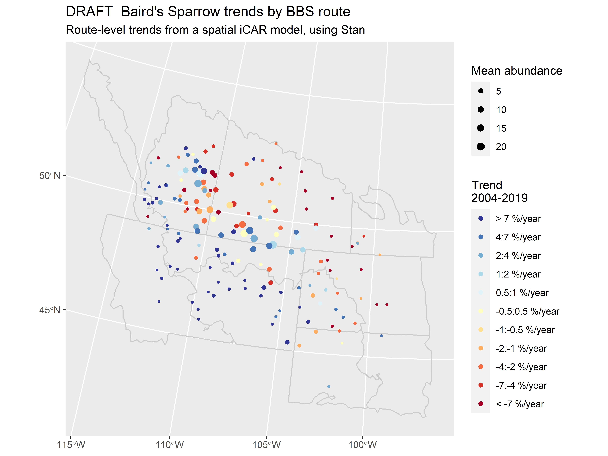
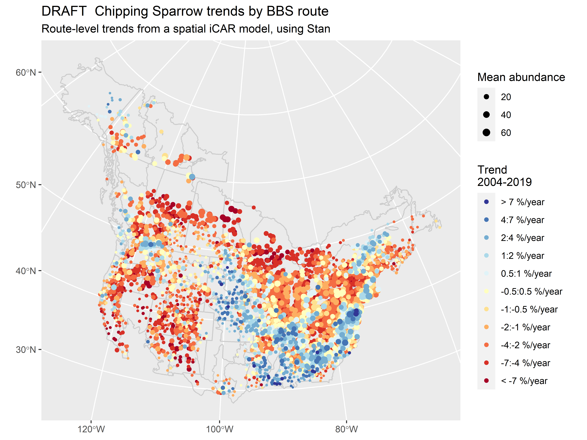
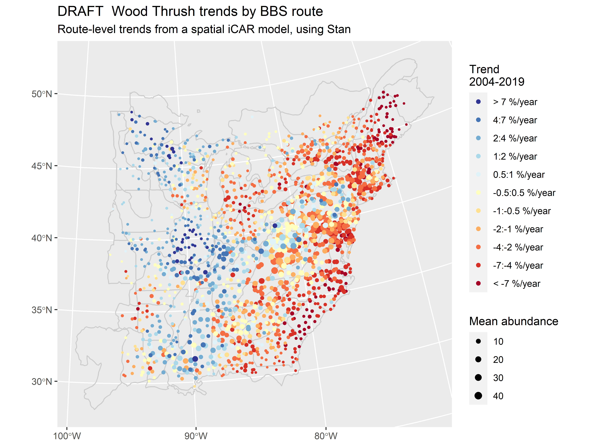

# BBS_iCAR_route_trends

NOTE: This is a work in progress. I anticipate having a pre-print by June 2023.

# The Goal(s)

A spatial model to estimate route-level trends from BBS data. One goal is to generate route-level trend estimates that could be used as data in a subsequent exploration of possible covariates of trends and abundances. 
Route-level trends also provide useful site-specific information for BBS observers. 

The model is written in Stan. It is based on the [bbsBayes](https://github.com/BrandonEdwards/bbsBayes), slope model (e.g., [Sauer and Link 2011](https://doi.org/10.1525/auk.2010.09220)), but without the random year-effects, and with no particular stratification.

The project includes comparing the predictive accuracy of different approaches to a route-level trends. Preliminary results suggest that the iCAR formulation outperforms a non-spatial approach that estimates a route-level trends as a random effect, as well as the BYM iCAR that includes both the iCAR structure and the route-level random effects. The iCAR seems to also out-perform a Gaussian Process (GP) approach to the spatial component, and additionaly the GP models require > 1 order of magnitude more computational time. 

## Interpretation of trends
Trends from this model represent log-linear slopes fit to the time-series of counts on a given BBS route. The model estimates the route-specific rate of change in counts for a given species, while accounting for the mean counts by the different observer(s) on the route, the start-up effect for each observers first year on a given BBS route, the mean counts at each route for an average observer, the spatial neighbourhood of each BBS route (i.e., the mean abundance for the species and the rate of change in abundance is a function of the counts on that route as well as the mean counts on routes surrounding it).  
The trend at a given route may not closely match the observed counts over time, if that route has had multiple observers over the time-series, the surrounding routes have a strong and consistent pattern of change (trends), and the species data support a relatively strong influence of neighbouring regions on trend and abundance.

## Acknowledgments and sources

I've relied strongly on elements from these two excellent case studies in Stan:

-   This [intrinsic CAR model structure for the BYM](https://mc-stan.org/users/documentation/case-studies/icar_stan.html) model from Mitzi Morris and co-authors.

-   I'm working at some elaborations of the model that would incorporate a route-level covariate based on this [exact sparse CAR model](https://mc-stan.org/users/documentation/case-studies/mbjoseph-CARStan.html) from Maxwell Joseph.

It's effectively an over-dispersed Poisson regression model with random slopes representing the trends at each route, random intercepts representing the mean abundance (mean count) on each route, as well as the among and within observers effects (true observers, see below)

## Estimated trends and abundances on Google Drive

I've applied this model to the BBS for \~400 species, for trends from 2004-2019. Estimated slopes, trends, and intercepts, for every route and species are available to explore in a personal [Google Drive](https://drive.google.com/drive/folders/1w5WMg-sdrrJaO9E8LYB-13GSWBVI2HE3?usp=sharing). The drive includes a readme file that explains the contents as well as trend maps for all species.

## Observer effects

The observer effects here are random effects for each observer, not the observer-route combinations, used in the bbsBayes models. This is a new thing for the hierarchical Bayesian BBS models. The MCMC algorithm of JAGS and BUGS has a great deal of trouble separately estimating observer effects from route-level intercepts. The HMC algorithm in Stan, plus the spatially explicit estimates of the route-level intercepts, appears to have much more success.

## Example output - Baird's Sparrow 2004-2019

Baird's Sparrow trends in the Great Plains. Dots represent BBS routes on which Baird's Sparrow has been observed between 2004 and 2019. Over this time period, there's an interesting spatial pattern: declines in the Northeast, increases in the Southwest.

## Example output - Chipping Sparrow 2004-2019

Chipping Sparrow trends over the last 15 years suggest the species has been increasing in the St-Lawrence River valley, in the southeastern portion of its range, and through some parts of the Great Plains.

## Example output - Wood Thrush 2004-2019

Wood Thrush trends over the last 15 years suggest the species has recently increased in the eastern parts of its range, and some portions of the Appalachians, but generally decreased in the regions where it is most abundant.

